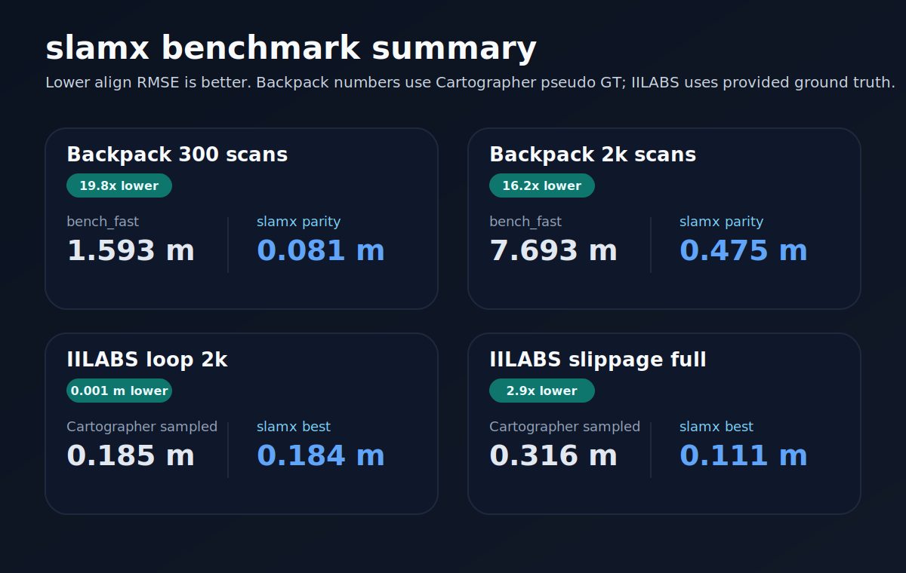
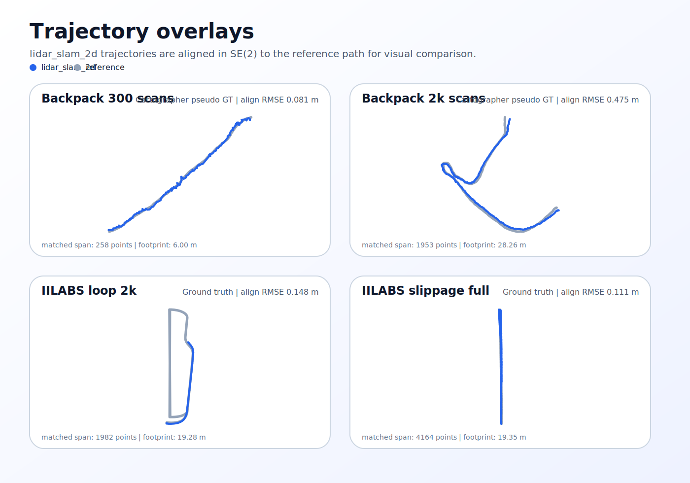

# lidar_slam_2d

Modern 2D LiDAR SLAM experiment platform with a ROS-free core and a CLI-first workflow for replay, evaluation, and benchmark iteration.





## Why this repo is worth publishing now

- **Backpack parity is already strong.** The current parity line takes the Cartographer backpack_2d pseudo-GT comparison from `1.593 -> 0.081 m` on the 300-scan slice and from `7.693 -> 0.475 m` on the 2k-scan slice.
- **GT-backed IILABS wins already exist.** Against Cartographer trajectories sampled at the same slamx timestamps, the current front-end is already ahead on `slippage`, `nav_a_omni`, `nav_a_diff`, and `ramp`, with matched-prefix wins on segmented-GT `loop` and `elevator`.
- **The workflow is inspectable.** Configs, notes, telemetry, and replay outputs are all tracked in a way that makes the iteration path understandable instead of hiding the tuning history.

## Quick start

```bash
pip install -e .
slamx replay examples/fixture_scans.jsonl --out runs/demo --no-write-map
slamx eval ate runs/demo --gt runs/cartographer_traj_s300_window.csv
```

The published project name is **`lidar_slam_2d`**. The CLI command remains **`slamx`** for now.

Optional ROS bag support:

```bash
pip install -e .[rosbag]
```

## Public site

A lightweight GitHub Pages site lives in `docs/` and can be deployed with `.github/workflows/pages.yml`.
The page is intentionally small and reuses the same SVG assets shown above.

## Current status

The public-facing story is ready, but the research line is still active. Backpack remains a Cartographer-parity benchmark against pseudo GT, while the GT-backed IILABS line already shows several wins over sampled Cartographer references. The main open work is long-run drift and loop-closure behavior on full-bag IILABS runs, not proving backpack "wins."

## Benchmark scope

- `notes/benchmark_cartographer_agreement_b0_2014-07-11.json` is the source of truth for `backpack_2d` parity against Cartographer pseudo GT.
- `notes/benchmark_iilabs_vs_cartographer_sampled_vlp16.json` is the source of truth for GT-backed IILABS comparisons against timestamp-aligned sampled Cartographer trajectories.

## Benchmark reproduction configs

For the Cartographer `backpack_2d` parity numbers, the exact recorded best runs now have fixed configs:

- `configs/cartographer_parity_medium_s300_locked.yaml` reproduces the best 300-scan run.
- `configs/cartographer_parity_noloop_s2k.yaml` reproduces the best 2k-scan run.

`configs/cartographer_parity_medium.yaml` remains the actively edited parity working config, and `configs/cartographer_parity_full.yaml` is retained only as a deprecated exploratory full-bag config.

## Refreshing the public assets

```bash
python tools/generate_public_assets.py
```
